# CeleryHub

Real-time monitoring, control, and scheduling for [Celery](https://docs.celeryq.dev/) clusters.

CeleryHub gives you a modern web dashboard to observe your Celery workers, inspect tasks, send jobs, manage queues, and orchestrate multi-step workflows — all from your browser.

<p align="center">
  <picture>
    <source media="(prefers-color-scheme: dark)" srcset="docs/screenshots/dashboard-dark.png">
    <source media="(prefers-color-scheme: light)" srcset="docs/screenshots/dashboard-light.png">
    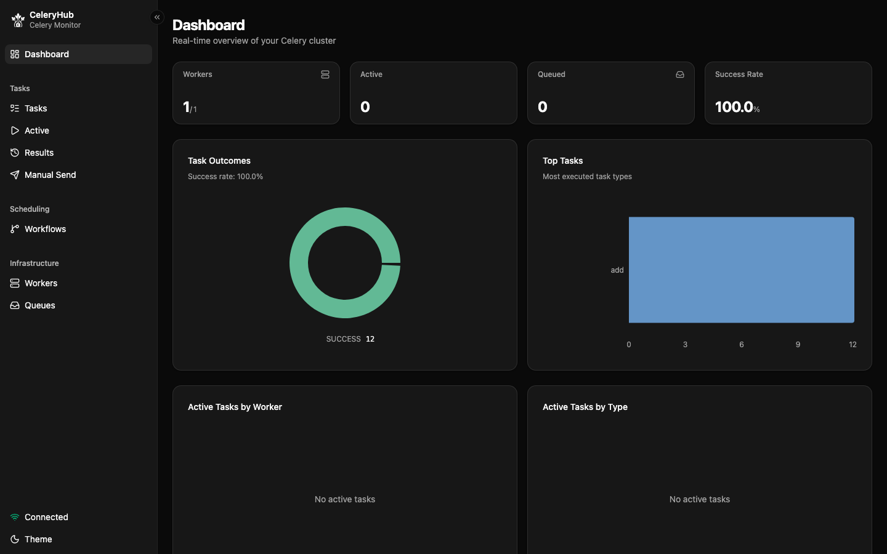
  </picture>
</p>

## Features

- **Live dashboard** — KPIs, throughput charts, task status breakdown, worker load, and event timeline updated in real time via SSE
- **Task management** — Browse registered tasks, view active/completed executions, retry, revoke, and inspect results or tracebacks
- **Active tasks** — Dedicated view for currently running tasks across all workers
- **Send tasks** — Dispatch any task to any queue with custom args/kwargs from the UI
- **Workers & queues** — Monitor connected workers, pool stats, uptime, and queue depth
- **Worker control** — Pool grow/shrink, rate limiting, and queue management (add/cancel consumers, shutdown, purge)
- **Workflows** — Orchestrate multi-step DAG pipelines with dependencies, conditions (`all_succeeded`, `any_failed`, `all_completed`), cron/interval scheduling, and visual DAG editor
- **History** — Search and filter completed tasks with results and exceptions

### Screenshots

<table>
  <tr>
    <td colspan="3" align="center">
      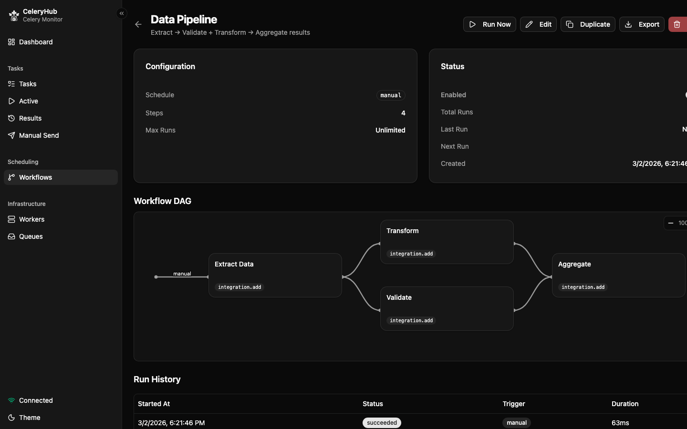
      <br><em>Workflow Detail (DAG)</em>
    </td>
  </tr>
</table>

| Workers | Tasks | History |
|---------|-------|---------|
| 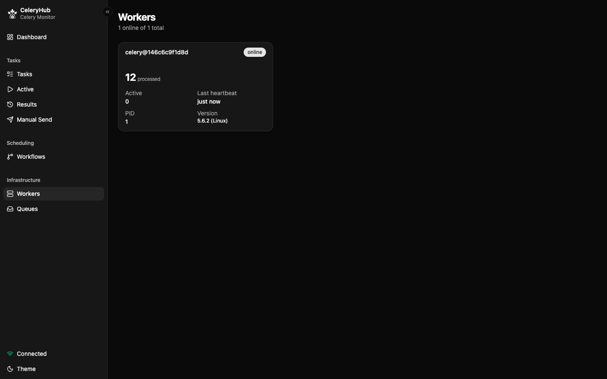 | 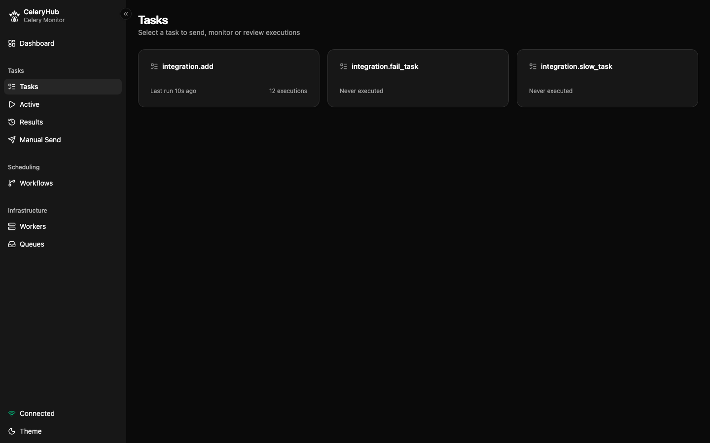 | 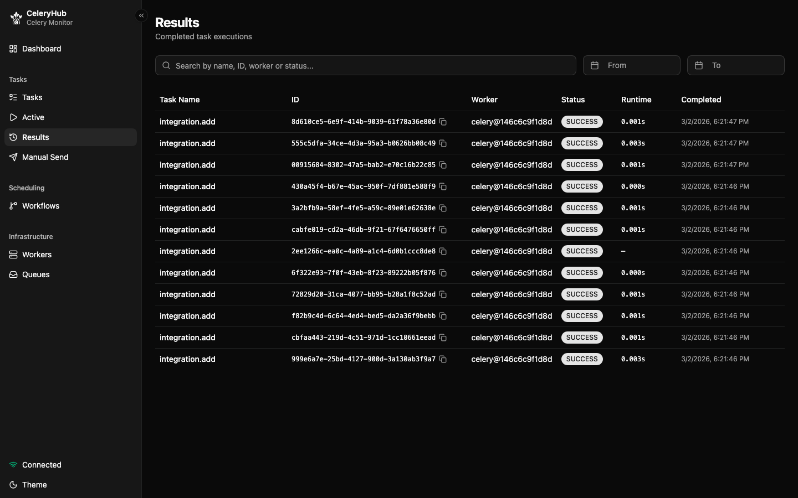 |

| Workflows | Workflow Run | Queues |
|-----------|-------------|--------|
| 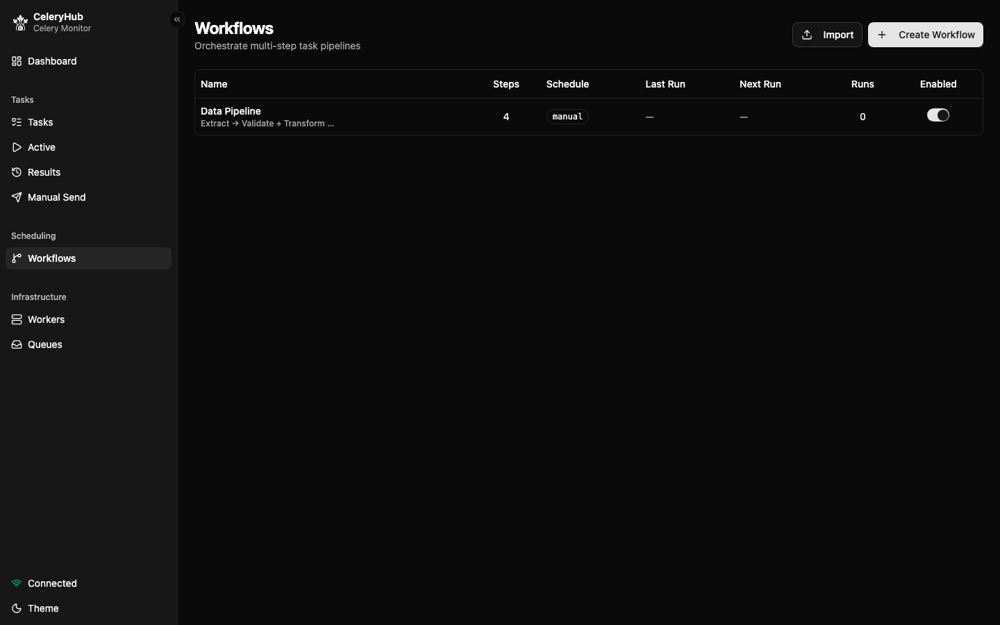 | 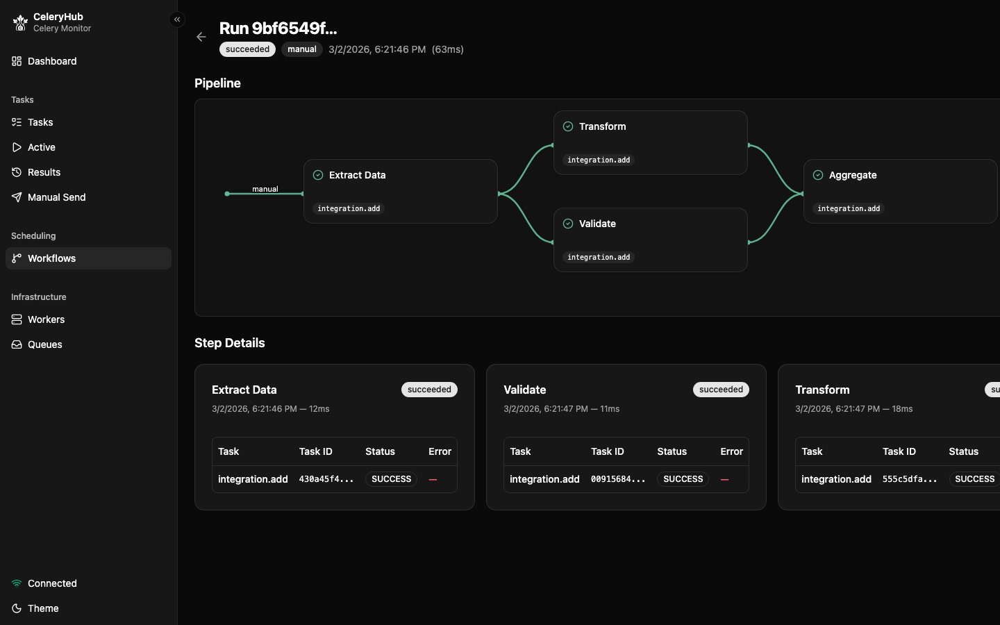 | 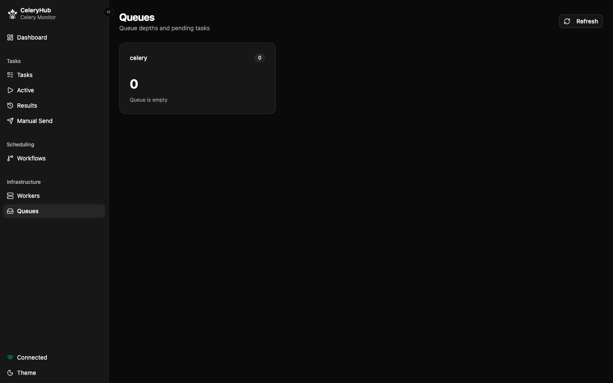 |

| Send Task |
|-----------|
| 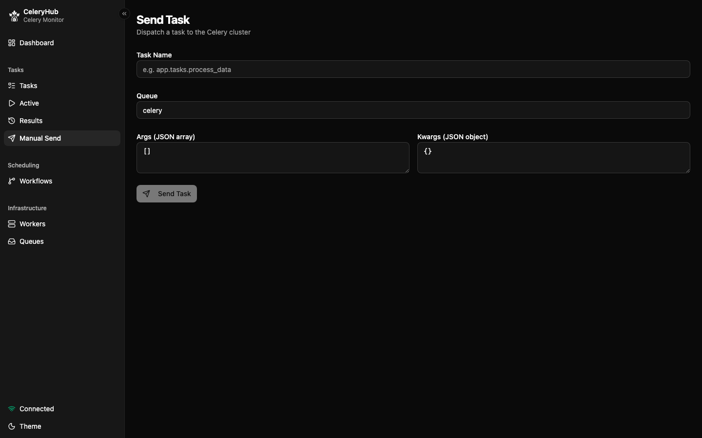 |

<details>
<summary>Light mode</summary>

| Dashboard | Workflow Detail |
|-----------|-----------------|
| 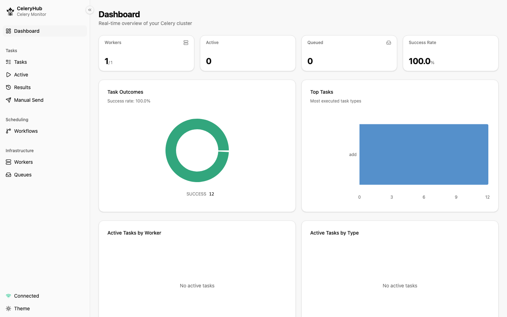 | 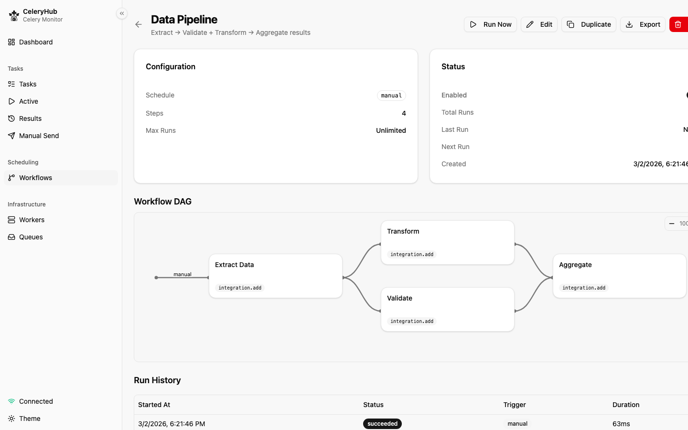 |

</details>

## Architecture

CeleryHub runs as a **single service** — FastAPI serves the REST API, SSE event stream, and the React SPA (static files) on one port.

```
┌─────────────────────────────────────────────────┐
│                    Browser                      │
│              React SPA (Vite)                   │
└────────────────────┬────────────────────────────┘
                     │ HTTP + SSE (port 3000)
┌────────────────────▼────────────────────────────┐
│           FastAPI Server (Python)                │
│   REST API · SSE stream · Workflow scheduler     │
│   Static SPA · SQLite · Redis pub/sub · Celery   │
└────────────────────┬────────────────────────────┘
                     │
              ┌──────▼──────┐
              │    Redis     │
              │   (broker)   │
              └──────┬───────┘
                     │
              ┌──────▼──────┐
              │   Celery     │
              │   Workers    │
              └─────────────┘
```

| Layer | Stack |
|---|---|
| Frontend | React 19, Vite, React Router v7, shadcn/ui, Recharts, Tailwind CSS v4 |
| Backend | FastAPI, Celery, SQLAlchemy 2.0 async, Pydantic, redis.asyncio |
| Database | SQLite (aiosqlite) |
| Broker | Redis |

## Quick Start

### Docker Compose (recommended)

The fastest way to get CeleryHub running:

```bash
docker compose up
```

This starts Redis and CeleryHub (with SQLite for persistence). Open [http://localhost:3000](http://localhost:3000) in your browser.

> **Note:** You still need Celery workers connected to the same Redis. Point your workers at `redis://localhost:6379/0`.

### Docker (standalone)

If you already have Redis running:

```bash
make docker
docker run \
  -e CELERY_BROKER_URL=redis://your-redis:6379/0 \
  -v celeryhub-data:/app/data \
  -p 3000:3000 celeryhub
```

CeleryHub uses SQLite by default (persisted at `/app/data/celeryhub.db`).

The Docker image bundles the FastAPI backend and React app into a single container, serving everything on port **3000**.

Pre-built images are available on GHCR:

```bash
docker pull ghcr.io/danield2g/celeryhub:latest
```

### Development

#### Prerequisites

- [Python](https://www.python.org/) >= 3.11 with [uv](https://docs.astral.sh/uv/)
- [Node.js](https://nodejs.org/) >= 18 (for the frontend build)
- A running Redis instance (used as Celery broker)
- Celery workers connected to that Redis

#### Install

```bash
make install
```

This installs the frontend npm packages and the Python gateway dependencies.

#### Configure

Copy the example env file and edit it:

```bash
cp .env.example .env.local
```

See [`.env.example`](.env.example) for all available variables.

| Variable | Default | Description |
|---|---|---|
| `CELERY_BROKER_URL` | — | Redis URL for the Celery broker **(required)** |
| `CELERYHUB_DB_PATH` | `./data/celeryhub.db` | SQLite database path |
| `CELERY_RESULT_BACKEND` | same as broker | Redis URL for task results |
| `PORT` | `3000` | Server port (API + frontend) |
| `CELERYHUB_TASK_TTL` | `604800` (7 days) | Redis TTL in seconds for task metadata. `0` = no expiration |
| `CORS_ORIGINS` | `[]` (empty) | Comma-separated list of allowed CORS origins |
| `CELERYHUB_AUTH_TOKEN` | _(empty)_ | Bearer token for destructive endpoints (empty = no auth) |
| `INSPECT_TIMEOUT` | `5.0` | Timeout in seconds for Celery inspect commands |
| `INSPECT_CACHE_TTL` | `3.0` | TTL in seconds for cached inspect results |

#### Run

```bash
make dev
```

This starts two services concurrently:

- **FastAPI Server** on `:3000` — API, SSE events, workflow scheduler, Celery inspect/control
- **Vite** on `:5173` — React app with HMR (proxies `/api` to `:3000`)

Open [http://localhost:5173](http://localhost:5173) in your browser.

> In production/Docker, only port **3000** is used — FastAPI serves both the API and the static SPA.

You can also run services individually:

```bash
make gateway   # Only the FastAPI server
make web       # Only the Vite dev server
```

## Build

```bash
make build
```

Builds the frontend (Vite) into `packages/web/dist/`.

## Project Structure

```
CeleryHub/
├── packages/
│   └── web/                    # React SPA
│       └── src/
│           ├── pages/          # Dashboard, Tasks, Workers, Workflows, ...
│           ├── components/     # Charts, dialogs, tables
│           ├── hooks/          # Data fetching hooks
│           └── lib/            # Types, utils, event handling
├── services/
│   └── celery-gateway/         # FastAPI backend (unified)
│       └── src/celery_gateway/
│           ├── routers/        # API endpoints
│           ├── services/       # Redis, cache, event collector, scheduler
│           ├── models/         # Pydantic models
│           └── db/             # SQLAlchemy models & migrations
├── tests/
│   └── integration/            # Docker Compose + Playwright E2E
├── .github/
│   └── workflows/              # CI/CD (Docker build on tags)
├── Makefile
└── Dockerfile
```

## API

All endpoints are under `/api`:

| Method | Path | Description |
|---|---|---|
| `GET` | `/api/tasks/active` | List active tasks |
| `GET` | `/api/tasks/history` | List completed tasks |
| `GET` | `/api/tasks/registered` | List registered task names |
| `GET` | `/api/tasks/payloads?name=X` | Get recent payloads for a task |
| `GET` | `/api/tasks/:id/status` | Get task status |
| `POST` | `/api/tasks/send` | Send a new task |
| `POST` | `/api/tasks/:id/revoke` | Revoke a task |
| `GET` | `/api/workers/inspect` | Inspect workers (multiple methods) |
| `GET` | `/api/workers/:method` | Single inspection method (`active`, `registered`, `reserved`, `scheduled`, `stats`, `conf`, `active_queues`) |
| `GET` | `/api/queues` | List queues and depth |
| `GET` | `/api/workflows` | List workflows |
| `POST` | `/api/workflows` | Create a workflow |
| `GET` | `/api/workflows/:id` | Get workflow details |
| `PUT` | `/api/workflows/:id` | Update a workflow |
| `DELETE` | `/api/workflows/:id` | Delete a workflow |
| `POST` | `/api/workflows/:id/toggle` | Enable/disable a workflow |
| `POST` | `/api/workflows/:id/run-now` | Run a workflow immediately |
| `POST` | `/api/workflows/:id/duplicate` | Duplicate a workflow |
| `GET` | `/api/workflows/:id/runs` | Get workflow run history |
| `GET` | `/api/workflows/runs/:runId` | Get workflow run details |
| `POST` | `/api/workflows/runs/:runId/cancel` | Cancel a workflow run |
| `GET` | `/api/events` | SSE event stream |
| `POST` | `/api/control/pool-grow` | Increase worker pool size |
| `POST` | `/api/control/pool-shrink` | Decrease worker pool size |
| `POST` | `/api/control/rate-limit` | Set task rate limit |
| `POST` | `/api/control/add-consumer` | Add queue to workers |
| `POST` | `/api/control/cancel-consumer` | Remove queue from workers |
| `POST` | `/api/control/shutdown` | Gracefully shut down workers |
| `POST` | `/api/control/purge` | Purge all messages from queues |

## Health Check

```bash
make health
```

## Resource Usage

CeleryHub is designed to be lightweight. Benchmarks run on a 3-stage Alpine-based Docker image with a single uvicorn worker, connected to a Redis broker with no Celery workers attached.

### Docker Image

| Metric | Value |
|---|---|
| Image size | **~80 MB** |
| Base image | `alpine:3.21` |
| Python runtime | 3.12 (system) |
| Build stages | 3 (node builder → python builder → runtime) |

### Memory

| Scenario | RAM | Notes |
|---|---|---|
| Idle (just started) | **~70 MB** | FastAPI + uvicorn + SQLite + Redis connection + background tasks (event collector, workflow scheduler, cache timers) |
| After light usage (all endpoints exercised) | **~73 MB** | Minimal increase |
| Under load (500 concurrent requests) | **~84 MB** | Mix of GET/POST across all endpoints |
| After cooldown | **~84 MB** | Memory stabilizes, no leaks observed |
| Redis sidecar | **~7.5 MB** | redis:7-alpine with minimal data |

### Conditions

- **Container:** Single uvicorn process (no `--workers`), Alpine Linux
- **Broker:** Redis 7 (Alpine) on the same host, empty (no Celery workers connected)
- **Database:** SQLite in-memory volume, ~2 workflows
- **Load test:** 500 requests fired concurrently (100 batches × 5 endpoints: `/health`, `/api/tasks/active`, `/api/queues`, `/api/workflows`, `POST /api/tasks/send`), 1 error (race condition on first request)
- **Host:** macOS, Docker Desktop, 16 GB RAM available to the VM

For production with real worker traffic, expect memory to grow proportionally to the number of cached tasks and active SSE connections. The multi-key background cache (`CeleryCache`) keeps data in-process with configurable TTLs (2–60s per key).

## Testing

CeleryHub includes a comprehensive test suite with **172 tests** covering unit, service, and API layers.

### Run tests

```bash
cd services/celery-gateway
uv pip install -e ".[test]"
pytest -v
```

### Coverage

```bash
pytest --cov=celery_gateway --cov-report=term-missing
```

### Test structure

```
tests/
├── conftest.py                    # Shared fixtures (DB, Redis, HTTP client)
├── unit/                          # Pure logic, no I/O
│   ├── test_kombu_parser.py             # Kombu message parsing (24 tests)
│   ├── test_redis_client.py             # URL parsing (8 tests)
│   ├── test_beat_scheduler_logic.py     # Cron/interval computation (17 tests)
│   ├── test_config.py                   # Settings defaults (5 tests)
│   └── test_pydantic_models.py          # Model validation (22 tests)
├── service/                       # With fakeredis / mocks
│   ├── test_celery_redis.py             # Redis operations (24 tests)
│   ├── test_cache.py                    # CeleryCache behavior (8 tests)
│   └── test_inspect_cache.py            # InspectCache TTL/stale (8 tests)
└── api/                           # Full HTTP via httpx + ASGI
    ├── test_workflows_router.py         # CRUD + toggle + run-now (30 tests)
    ├── test_tasks_router.py             # Send, revoke, status (20 tests)
    ├── test_queues_router.py            # Queue details (3 tests)
    └── test_health.py                   # Health check (3 tests)
```

Key test dependencies: `pytest`, `pytest-asyncio`, `httpx`, `fakeredis`, `pytest-cov`.

### Integration tests

The `tests/integration/` directory contains end-to-end tests that run against real services via Docker Compose:

- **`test_api.py`** — REST API tests against CeleryHub + Redis + a Celery worker
- **`test_frontend.py`** — Browser tests with Playwright
- Test worker with 3 tasks: `integration.add`, `integration.slow_task`, `integration.fail_task`

```bash
make test-integration
```

Requires Docker.

## CI/CD

GitHub Actions builds and pushes a multi-tag Docker image to GHCR on every version tag (`v*`):

```
ghcr.io/danield2g/celeryhub:latest
ghcr.io/danield2g/celeryhub:<version>
```

See [`.github/workflows/docker-build.yml`](.github/workflows/docker-build.yml).

## Security

CeleryHub is a monitoring tool typically deployed on private or internal networks. It does **not** include built-in authentication.

For production deployments, place CeleryHub behind a reverse proxy that handles auth:

- **nginx** with `auth_basic` or OAuth2 proxy
- **Traefik** with middleware
- **Cloudflare Tunnel** with Access policies

CeleryHub includes CORS controls (`CORS_ORIGINS`), request body size limits, and input validation on task names and signals. Redis TLS is supported — use a `rediss://` broker URL.

## License

[MIT](LICENSE)
